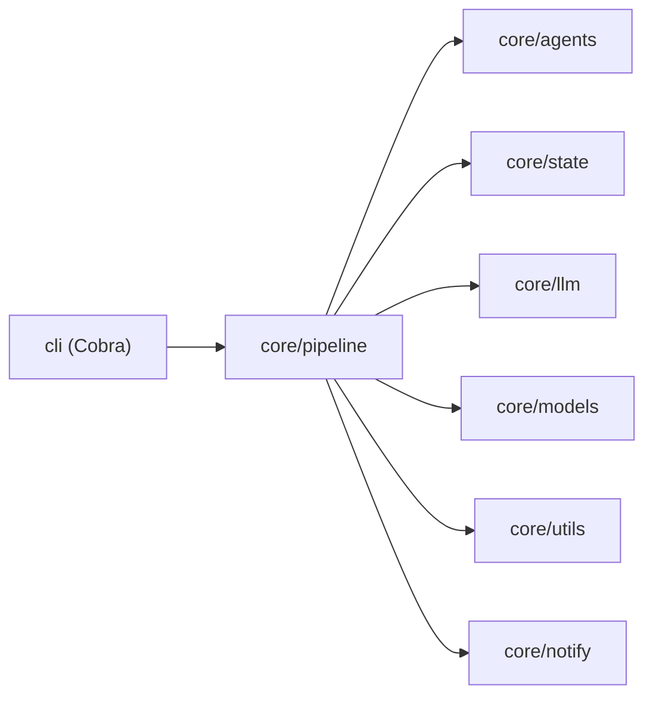

# iPen

iPen 是一个面向长篇小说创作的多智能体系统。本文档覆盖 Golang 版本的 `core` 与 `cli` 两个模块。

## 模块定位

- `cli`：基于 Cobra 的命令行入口，负责编排项目初始化、配置、书籍管理、章节写作与运维命令。
- `core`：核心业务库，包含智能体、LLM 适配、写作流水线、状态管理、通知与工具能力。


## 调用流程



## Core 包结构

- `core/agents`：Planner / Composer / Writer / Auditor / Reviser / Architect 等智能体。
- `core/llm`：OpenAI / Anthropic 适配与流式/非流式调用。
- `core/models`：项目、书籍、章节、状态等领域模型。
- `core/pipeline`：章节流水线与调度器（daemon）。
- `core/state`：书籍目录、章节索引、快照、回滚、状态修复。
- `core/notify`：通知分发。
- `core/utils`：配置加载、日志、文本统计、辅助函数。

## 运行要求

- Go `1.25.x`（`core/go.mod` 与 `cli/go.mod` 均为 `go 1.25.0`）。
- 可用的 LLM API（OpenAI / Anthropic / 兼容端点）。
- Windows / macOS / Linux 均可运行（CLI 为跨平台 Go 程序）。

## 构建与启动（CLI）

```bash
cd cli
go build -buildvcs=false -o ipen .
./ipen --help
```

## 快速开始

```bash
# 1) 初始化项目（会创建 ipen.json、.env、books/、radar/）
ipen init my-novel --lang zh

# 2) 进入项目目录
cd my-novel

# 3) 配置全局模型（写入 ~/.ipen/.env）
ipen config set-global \
  --provider openai \
  --base-url https://api.openai.com/v1 \
  --api-key <YOUR_KEY> \
  --model gpt-4.1-mini

# 4) 创建书籍（自动生成设定文件）
ipen book create --title "我的小说" --genre xuanhuan --platform tomato --lang zh

# 5) 创作下一章
ipen write next <book-id>

# 6) 查看状态
ipen status --chapters
```

## 配置体系

- 项目配置文件：`<project>/ipen.json`
- 全局环境配置：`~/.ipen/.env`
- 项目环境覆盖：`<project>/.env`

配置加载顺序（`core/utils/config-loader.go`）：

1. 读取全局 `.env`
2. 读取项目 `.env`（覆盖全局）
3. 读取 `ipen.json`
4. 将环境变量覆盖写回运行时配置

常用命令：

```bash
ipen config show
ipen config list
ipen config get llm.model
ipen config set llm.model gpt-4.1-mini
ipen config set-model writer gpt-4.1
ipen config show-models
```

## 主要命令（仅 Go CLI）

- `init`：初始化项目目录与基础配置。
- `config`：全局/项目配置管理、模型路由。
- `book`：创建、更新、列出、删除书籍。
- `write`：`next` / `rewrite` / `repair-state`。
- `review`：章节审查与批准流程。
- `revise`：章节修订。
- `audit`：章节审计。
- `status`：项目与章节状态统计。
- `radar`：变化监控与检测。
- `daemon`：定时写作与巡检任务管理（`up/down`）。
- `doctor`：配置/环境/连通性体检。
- `plan` / `compose` / `draft` / `consolidate`：写作中间环节与整合。
- `detect` / `eval` / `analytics`：质量检测、评估与数据分析。
- `style` / `genre` / `fanfic` / `agent` / `import` / `export` / `update`：扩展管理能力。

## 章节流水线（core/pipeline）

`RunChapterPipeline` 默认执行 4 个阶段：

1. `Plan`：规划章节意图与运行时输入。
2. `Compose`：组装上下文包与规则栈。
3. `Write`：生成章节正文。
4. `Settle`：落盘并快照状态。

最终输出包含章节标题、字数、状态与 token 使用量。

## 项目数据布局（单本书）

```text
<project>/
  ipen.json
  .env
  books/
    <book-id>/
      book.json
      .write.lock
      chapters/
        index.json
        <n>_<title>.md
      story/
        author_intent.md
        current_focus.md
        story_bible.md
        volume_outline.md
        book_rules.md
        current_state.md
        pending_hooks.md
        chapter_summaries.md
        subplot_board.md
        emotional_arcs.md
        character_matrix.md
        runtime/
        snapshots/
          <chapter>/
            ...
        state/
          ...
```

## 开发与质量检查

### Core

```bash
cd core
go test ./...
go vet ./...
go build ./...
go mod tidy -diff
gofmt -l .
```

### CLI

```bash
cd cli
go test ./...
go vet ./...
go build ./...
go mod tidy -diff
gofmt -l .
```

## 体检结论（2026-04-05）

- `cli`：`test/vet/build/mod tidy/gofmt` 全部通过。
- `core`：`test/vet/build/mod tidy` 全部通过。

---

如果你准备把 iPen 用于团队协作，建议先统一 `ipen.json` 模板与 `config set-global` 的组织级默认模型策略，再开始批量建书与守护进程调度。